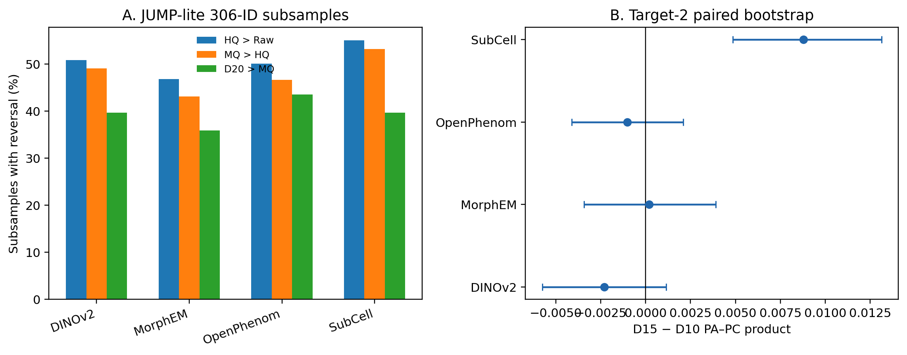

# Compression-order robustness

## Direct answer

Small fixed-recipe cohorts frequently change adjacent codec orderings, so the non-monotonic Target-2 ordering cannot by itself be interpreted as compression improving biological signal. The direct D10/D15 result is model-dependent under a Zstd-selected fixed recipe.

## JUMP-lite 306-treatment sensitivity

We generated 2,000 deterministic stratified samples (seed `20260814`), each with exactly 306 held-out treatment-ID clusters. Each observed treatment/group unit contributed exactly four distinct wells, and all frozen common controls from represented plate/group pairs were included. The same manifests were applied to all 16 fixed model/codec profiles.

This is a stratified 306-ID/four-well-per-treatment-group sensitivity, not a literal four-plate replica and not an analysis of D10/D15. It conditions on archived transformations and the Raw-validation-selected recipes.

After the established PC target-count/promiscuity filtering, 9045 of 181484 compound/group query rows (4.98%) in 1968 samples (98.40%) could not themselves define retrieval AP (9043 lacked an eligible positive; 2 lacked a disjoint eligible negative). Of these, 9032 were record-only no-positive queries that copairs naturally does not emit. Actual row removal occurred for 13 compound/group rows (52 selected profile rows) in 3 of 2000 samples (0.15%): two no-negative rows and one wholly no-positive group of 11 rows. For those affected samples only, PC is explicitly a modified restricted estimand after removing undefined rows; it is not the unchanged established PC estimand. Metadata-only records and removals were frozen in `manifests/pc_undefined_queries.parquet` and `manifests/pc_removed_rows.parquet` and applied identically to all 16 variants. PA and sample manifests were unchanged, and no other PC failure is suppressed.

The primary inference is the adjacent within-sample reversal rate. As a secondary comparison, rank correlation and six-pair discordance use a directly matched group_high/group_low full-population baseline computed from key-aligned archived per-unit PA (3,654 treatment/group rows) and PC (669 target/group rows); this is not the all-group heldout_test_scores.csv product.

| Model | HQ > Raw | MQ > HQ | D20 > MQ | Any adjacent reversal | Mean rank rho vs matched full |
|---|---:|---:|---:|---:|---:|
| DINOv2 | 50.8% | 49.0% | 39.6% | 94.3% | 0.114 |
| MorphEM | 46.8% | 43.0% | 35.9% | 87.6% | 0.282 |
| OpenPhenom | 50.0% | 46.6% | 43.5% | 93.0% | 0.148 |
| SubCell | 55.0% | 53.2% | 39.6% | 93.3% | 0.126 |

The matched baseline is in `results/matched_full_baseline.csv`; all six pairwise codec discordance rates and PA/PC/product distributions are in `results/full_pairwise_discordance.csv` and `results/full_metric_distributions.csv`.

## Target-2 fixed-recipe D10 versus D15

One recipe per learned model was selected using Zstd only by the manuscript metric PA×PC/100, with lexical tie resolution. That exact recipe was required for Zstd, D10, and D15. PA's 306 compound clusters and PC's 201 target clusters were resampled with common weights across all models/codecs within each margin for 50,000 replicates (seed `20260814`). PA and PC were independently sampled and multiplied under a working product-of-margins model.

| Model | Zstd product | D10 product | D15 product | D15 − D10 (95% interval) | Holm result |
|---|---:|---:|---:|---:|---|
| DINOv2 | 0.02932 | 0.02109 | 0.01878 | -0.00231 [-0.00576, +0.00115] | unresolved ($p_{Holm}=0.5673$) |
| MorphEM | 0.04328 | 0.03172 | 0.03191 | +0.00020 [-0.00343, +0.00390] | unresolved ($p_{Holm}=1$) |
| OpenPhenom | 0.01972 | 0.01476 | 0.01373 | -0.00102 [-0.00412, +0.00209] | unresolved ($p_{Holm}=1$) |
| SubCell | 0.03398 | 0.02109 | 0.02988 | +0.00879 [+0.00485, +0.01312] | D15>D10 ($p_{Holm}=0.0008$) |

Percentile intervals are pointwise. The four D15-vs-D10 product tests use Holm correction. The product intervals/tests omit unknown PA–PC covariance and may be too narrow or too wide; they are conditional on frozen per-unit retrieval outputs, target eligibility, and Zstd-selected recipes. Independent per-codec winners are not used.

## Provenance and runtime

- Eligible stratum counts: `{'group_high': 290, 'group_high|group_low': 496, 'group_low': 1567}`; quotas: `{'group_high': 38, 'group_high|group_low': 64, 'group_low': 204}`.
- Full subsampling wall time was 6313.9 seconds with spawn-isolated variant workers; Target-2 bootstrap took 1.3 seconds.
- Canonical archives were read only; no normalization, extraction, or sweep was rerun.
- See `provenance.json`, `artifact_checksums.json`, and `manifests/` for frozen identities and hashes.

