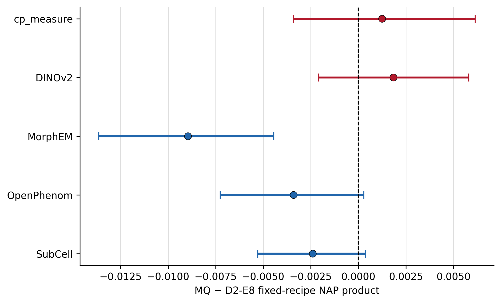

# Fixed-recipe Target-2 MQ versus D2-E8 bootstrap

## Design

One recipe per Figure-3c family was selected using Zstd PA×PC/100 only, with lexical exact-tie resolution, then fixed across D2-E8 and MQ. The archived 306 PA broad-sample clusters and 201 PC target clusters were resampled independently with shared weights across every family/codec within each margin for 50,000 deterministic PCG64DXSM replicates.

The product is a working product-of-margins model. Its interval and test omit unknown PA–PC covariance and are conditional on archived normalized outputs and the selected recipes; they are not end-to-end uncertainty.

## Selected recipes

- cp_measure: `std_ctrl__outlier100__INT__prune0.9__tvn_efaar_e0.05`
- DINOv2: `robustmad_ctrl__prune0.9__tvn_efaar_e0.05`
- MorphEM: `robustmad_all__prune0.9__tvn_efaar_e0.05`
- OpenPhenom: `std_all__prune0.9__tvn_efaar_e0.05`
- SubCell: `robustmad_ctrl__prune0.9__tvn_efaar_e0.05`

## Results

| Family | MQ-D2-E8 PA NAP | MQ-D2-E8 PC NAP | MQ-D2-E8 product (95% interval) | Holm result |
|---|---:|---:|---:|---|
| cp_measure | +0.03343 | -0.00360 | +0.00125 [-0.00341, +0.00614] | unresolved (p_Holm=0.7063) |
| DINOv2 | -0.00469 | +0.00453 | +0.00185 [-0.00208, +0.00581] | unresolved (p_Holm=0.7063) |
| MorphEM | -0.00828 | -0.01620 | -0.00895 [-0.01365, -0.00444] | D2-E8>MQ (p_Holm=0.001) |
| OpenPhenom | +0.00603 | -0.00861 | -0.00340 [-0.00727, +0.00029] | unresolved (p_Holm=0.3087) |
| SubCell | -0.01330 | -0.00348 | -0.00240 [-0.00528, +0.00036] | unresolved (p_Holm=0.3087) |

Pointwise intervals are percentile intervals. Product p-values use a centered bootstrap and Holm adjustment across the five predeclared family contrasts. Non-support is not equivalence. Results do not establish denoising or biological improvement.

