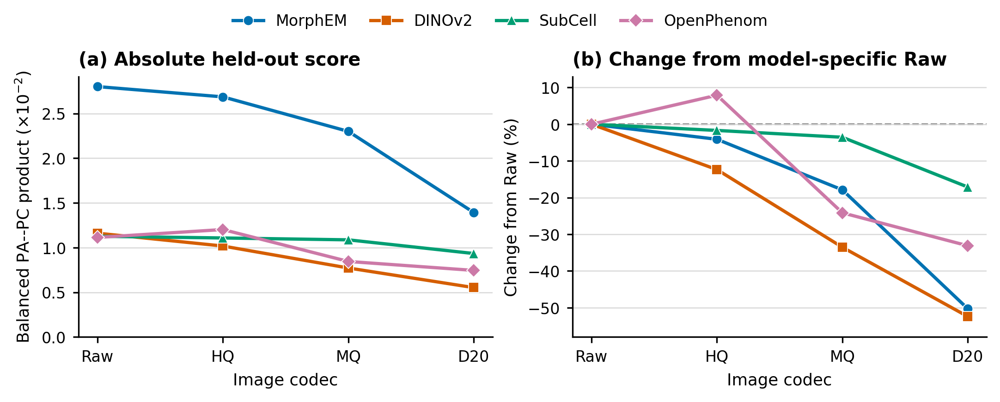

# Post-processing validation/test analysis

Generated: 2026-08-11T18:39:18.725962+00:00

**Run class:** PRODUCTION.

## Protocol

- Frozen archive: `/work/datasets/JUMP-lite-wacv/sweeps/variance_first_v11_lite` (read only).
- Split: SHA-256 seed `20260811`, 20% validation and 80% test, stratified by each treatment's composite group membership.
- Treatments: 5,375 validation and 21,502 test `Metadata_JCP2022` IDs; controls are shared references and are not split treatments.
- Selection: Raw validation treatments only; archived per-treatment PA NAP plus recomputed validation PC NAP. Each metric is min-max scaled within family, then multiplied.
- Evaluation: the exact selected configuration is pinned across all intended codecs and recomputed on held-out test treatments over one frozen common-well population.
- Frozen common manifest: 148,253 `Metadata_id` values.
- Held-out evaluation: 121,922 test-plus-control wells (108,012 test wells and 13,910 shared controls), covering 21,497/21,502 assigned test IDs, 22,068 treatment/group PA units, and 669 target/group PC units.

## Selected configurations

| Family | Config | Validation PA NAP | Validation PC NAP | Score | Runner-up |
|---|---|---:|---:|---:|---|
| DINOv2 | `std_ctrl__tvn_efaar_e0.1_c304` | 0.3301 | 0.0580 | 0.8252 | `std_ctrl__tvn_efaar_e0.1_c304__noprune` |
| MorphEM | `std_ctrl__tvn_efaar_e1.0_c304` | 0.5456 | 0.0766 | 0.9910 | `std_ctrl__tvn_efaar_e1.0_c304__noprune` |
| OpenPhenom | `std_all__tvn_efaar_e0.2_c150` | 0.3730 | 0.0569 | 0.9049 | `std_all__tvn_efaar_e0.2_c150__noprune` |
| SubCell | `std_ctrl__tvn_efaar_e0.2_c96` | 0.3437 | 0.0532 | 0.9441 | `std_ctrl__tvn_efaar_e0.2_c96__noprune` |
| CellProfiler | `robustmad_all__outlier100__INT__prune0.9__tvn_efaar_e0.1_c196` | 0.5270 | 0.0850 | 0.7985 | `robustmad_all__outlier100__INT__prune0.9__tvn_efaar_e0.1_c304` |
| ViT-rand | `std_all__tvn_efaar_e0.05_c304` | 0.1040 | 0.0181 | 0.8186 | `std_all__tvn_efaar_e0.05_c304__noprune` |
| CellCount | `robustmad_all` | 0.2646 | 0.0155 | 0.9098 | `std_ctrl` |

## Held-out fixed-configuration results

| Family | Codec | PA mean NAP | PC mean NAP | Product | Wells | PA units | PC targets |
|---|---|---:|---:|---:|---:|---:|---:|
| CellCount | Raw | 0.2618 | 0.0080 | 0.0021 | 121,922 | 22,068 | 669 |
| CellProfiler | Raw | 0.5333 | 0.0458 | 0.0244 | 121,922 | 22,068 | 669 |
| DINOv2 | D20 | 0.2491 | 0.0222 | 0.0055 | 121,922 | 22,068 | 669 |
| DINOv2 | HQ | 0.3258 | 0.0312 | 0.0102 | 121,922 | 22,068 | 669 |
| DINOv2 | MQ | 0.3056 | 0.0252 | 0.0077 | 121,922 | 22,068 | 669 |
| DINOv2 | Raw | 0.3307 | 0.0351 | 0.0116 | 121,922 | 22,068 | 669 |
| ViT-rand | D20 | 0.1070 | 0.0012 | 0.0001 | 121,922 | 22,068 | 669 |
| ViT-rand | HQ | 0.1105 | 0.0038 | 0.0004 | 121,922 | 22,068 | 669 |
| ViT-rand | MQ | 0.1167 | 0.0042 | 0.0005 | 121,922 | 22,068 | 669 |
| ViT-rand | Raw | 0.1038 | 0.0063 | 0.0006 | 121,922 | 22,068 | 669 |
| MorphEM | D20 | 0.4029 | 0.0346 | 0.0139 | 121,922 | 22,068 | 669 |
| MorphEM | HQ | 0.5337 | 0.0503 | 0.0269 | 121,922 | 22,068 | 669 |
| MorphEM | MQ | 0.4966 | 0.0463 | 0.0230 | 121,922 | 22,068 | 669 |
| MorphEM | Raw | 0.5486 | 0.0511 | 0.0280 | 121,922 | 22,068 | 669 |
| OpenPhenom | D20 | 0.2758 | 0.0270 | 0.0074 | 121,922 | 22,068 | 669 |
| OpenPhenom | HQ | 0.3828 | 0.0314 | 0.0120 | 121,922 | 22,068 | 669 |
| OpenPhenom | MQ | 0.3526 | 0.0240 | 0.0084 | 121,922 | 22,068 | 669 |
| OpenPhenom | Raw | 0.3751 | 0.0297 | 0.0111 | 121,922 | 22,068 | 669 |
| SubCell | D20 | 0.3036 | 0.0308 | 0.0093 | 121,922 | 22,068 | 669 |
| SubCell | HQ | 0.3407 | 0.0325 | 0.0111 | 121,922 | 22,068 | 669 |
| SubCell | MQ | 0.3365 | 0.0323 | 0.0109 | 121,922 | 22,068 | 669 |
| SubCell | Raw | 0.3419 | 0.0330 | 0.0113 | 121,922 | 22,068 | 669 |

## Completeness and failures

- Candidate failures: 0 (see `selection_failures.csv` when nonzero).
- Exact tied validation winners: 5; ties were broken lexically and are not evidence of a uniquely optimal recipe.
- Exact codec coverage was required for every selected configuration; no per-codec fallback was permitted.
- Native and common-well counts are in `selected_codec_coverage.csv`.

## Interpretation and limitations

This analysis isolates **post-processing configuration selection**: no held-out treatment score was used to choose a configuration. It is not a strict inductive preprocessing holdout. The archived normalized matrices were fitted before the treatment split, and all-profile feature filtering or normalization can therefore expose test-distribution information even though labels and test scores were not used for configuration selection.

The split is treatment-disjoint, not target-disjoint, and the point-estimate model ordering must remain descriptive until paired perturbation/target uncertainty is reported. Validation selection uses a within-family min-max-scaled product, whereas the held-out table reports the unscaled PA mean NAP times PC mean NAP; those products are not directly comparable.

The archived PA validation scores are reusable because each treatment/group NAP was constructed from that treatment's replicates and same-plate/group negative controls; full-cohort PA significance rates were not reused. PC was recomputed because its retrieval population depends on which treatments are present.

The active staging cleanup does not modify these frozen WACV normalized profiles. A fresh image/embedding extraction after deletion of negative-control images is not interchangeable: those controls are required for control-fitted normalization and PA reference construction.

The existing full-data, cross-codec best-average fixed-configuration analysis remains a separate sensitivity check. Its configuration selection uses all treatments/codecs and must not be described as this validation/test result.

CellProfiler and CellCount have Raw profiles only. CellProfiler also retains the manuscript's known site-count asymmetry relative to the four-site deep-learning inputs.

## Figure

The left panel reports the absolute unscaled PA--PC product; the right panel reports each learned model's point-estimate percentage change from its own Raw score. No uncertainty intervals are shown because the paired uncertainty analysis remains separate.

## Output inventory

- `treatment_split.csv` / `split_summary.csv`: frozen split and stratum counts.
- `validation_config_scores.csv`: all successful Raw validation candidates and ranks.
- `selected_configs.csv`: pinned family configurations and runner-up margins.
- `heldout_test_scores.csv`: primary held-out results.
- `heldout_codec_performance.pdf` and `.png`: reproducible paper figure.
- `per_unit/*`: held-out PA treatment and PC target tables for uncertainty analyses.
- `provenance.json` and `selected_codec_coverage.csv`: archive/config paths, hashes, and coverage.
